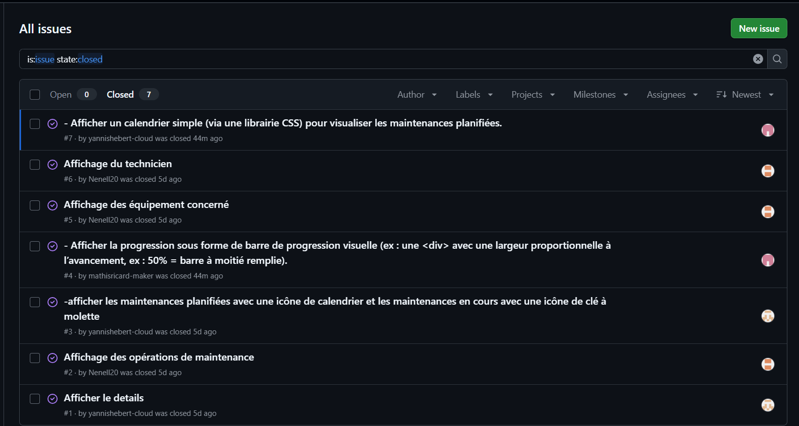

# Compte Rendu - TP3 : Gestion Matériel Groupe 5

## 1. Identification

- **Nom et Prénom :** Yannis HEBERT, Mathis RICARD, Naël MIGNET
- **Date :** Mardi 15 Septembre 2026
- **Nom du dépôt Github :** Gestion-materiel-groupe-5
- **URL du dépôt Github :** https://github.com/Nenell20/Gestion-materiel-groupe-5.git

---

## 2. Présentation

### Rôle de l'application

Ce projet répond au **Sujet 5 : Suivi de la maintenance des équipements**.

Le service informatique de l'entreprise souhaite pouvoir suivre les opérations de maintenance
(préventive et corrective) réalisées sur les équipements de son parc. L'application, développée en
Python (Flask), permet de :

- consulter la liste des opérations de maintenance enregistrées ;
- afficher le détail de chaque opération (équipement concerné, technicien responsable, rapport
  d'intervention, etc.) ;
- visualiser rapidement l'état d'avancement de chaque maintenance ;
- filtrer et trier les opérations selon plusieurs critères.

### Rôle de `origin` dans `git remote add origin URL_DU_DEPOT`

Dans cette commande, **`origin`** est le nom de raccourci attribué par convention à l'adresse du dépôt
distant sur GitHub. Cela évite d'avoir à ressaisir l'URL complète à chaque fois qu'on souhaite interagir
avec le serveur distant (ex : `git push origin main`).

---

## 3. Les principales commandes Git

- **`git init`** : Initialise un nouveau dépôt Git local dans le dossier courant en créant le sous-dossier
  masqué `.git`.
- **`git add`** : Ajoute des modifications ou de nouveaux fichiers à la zone d'index (*staging area*)
  pour les préparer au prochain commit.
- **`git commit`** : Enregistre l'état actuel des fichiers indexés dans l'historique du dépôt local avec
  un message explicatif.
- **`git push`** : Envoie les commits enregistrés localement vers le dépôt distant (sur GitHub).
- **`git pull`** : Récupère les dernières modifications depuis le dépôt distant et les fusionne
  directement dans la branche locale active.
- **`git clone`** : Télécharge une copie complète d'un dépôt distant (code, branches et tout
  l'historique des commits) sur sa machine locale.

---

## 4. Fonctionnalités

Fonctionnalités développées dans l'application :

- [x] Affichage de la liste des opérations de maintenance
- [x] Affichage du détail d'une opération (équipement concerné, responsable, rapport)
- [x] Distinction visuelle des maintenances **planifiées** (icône calendrier) et **en cours**
      (icône clé à molette)
- [x] Barre de progression visuelle correspondant à l'avancement de chaque opération
- [x] Calendrier simple permettant de visualiser les maintenances planifiées
- [x] Filtres par nature de l'action, progression, cible technique et responsable
- [x] Mise en forme avec CSS (`static/`)

---

## 5. Installation

Cloner le dépôt puis installer les dépendances Python :

```bash
cd Gestion-materiel-groupe-5
pip install -r requirements.txt
```

---

## 6. Lancement

```bash
python app.py
```

L'application est ensuite accessible depuis un navigateur à l'adresse indiquée dans le terminal
(généralement `http://127.0.0.1:5000`).

---

## 7. Organisation du projet

| Fichier / Dossier    | Rôle                                                                 |
|-----------------------|----------------------------------------------------------------------|
| `app.py`              | Point d'entrée de l'application Flask, définit les routes            |
| `data/`               | Contient les données au format JSON (opérations de maintenance)      |
| `templates/`          | Pages HTML (Jinja2) affichées par l'application                      |
| `static/`             | Feuilles de style CSS, scripts JS et ressources statiques            |
| `tests/`               | Fiches et scripts de tests de l'application                          |
| `requirements.txt`    | Liste des dépendances Python nécessaires au projet                   |
| `.gitignore`          | Fichiers/dossiers exclus du suivi Git (ex : environnement virtuel)   |
| `README.md`           | Documentation du projet                                              |

---

## 8. Membres

| Membre           | Rôle principal                                              |
|-------------------|---------------------------------------------------------------|
| Yannis HEBERT      | codage d'une partie json, index.html et css                  |
| Mathis RICARD      | codage d'une partie json, index.html et css et gant            |
| Naël MIGNET        | creation et gestion du projet et un peu de codage index.html           |

---

## 9. Gestion du projet

### Issues


### GitHub Project / Kanban
 https://github.com/Nenell20/Gestion-materiel-groupe-5.git

### Pull Requests
*(Lister les principales Pull Requests réalisées, avec une courte description, ex : "PR #5 : ajout du
calendrier des maintenances".)*

---

## 10. Publication du projet

### Étapes de publication initiale :

1. **Création du dépôt local :** Dans le dossier du projet contenant les fichiers (`app.py`, `templates/`,
   `static/`, etc.), le dépôt Git local a été initialisé via la commande `git init`. Les fichiers ont
   ensuite été indexés (`git add .`) puis validés (`git commit -m "Initial commit"`).
2. **Association du dépôt distant :** Après avoir créé un dépôt vide nommé `Gestion-materiel-groupe-5`
   sur GitHub, il a été lié au dépôt local avec la commande :
   ```bash
   git remote add origin https://github.com/Nenell20/Gestion-materiel-groupe-5.git
   ```
3. **Ajout des collaborateurs** dans le dossier GitHub partagé, et des droits d'administrateur.
4. **Choix du projet** et répartition des rôles et activités que chacun devait faire.
5. **Travail en autonomie** sur nos tâches respectives.
6. **Partage** de nos résultats en faisant un dossier partagé sur `Visual Studio Code`, pour être plus
   productifs.
7. **Finalisation** en équipe et vérifications.
8. **Publication finale du projet**.
